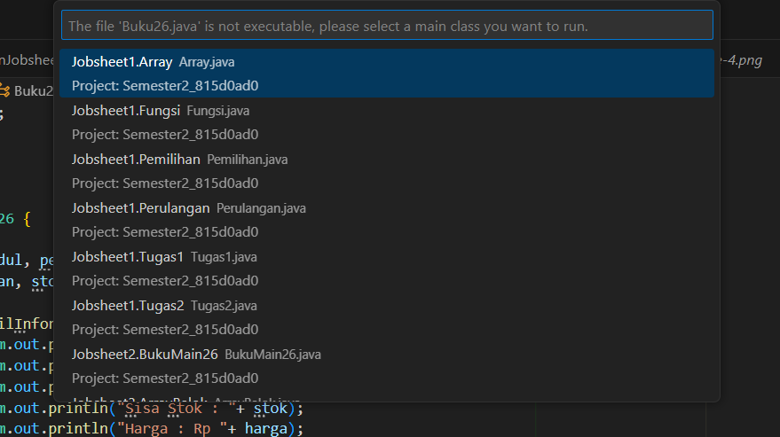
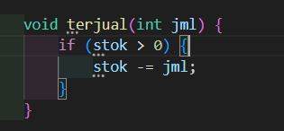
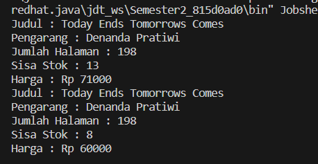
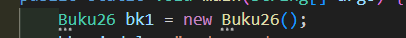
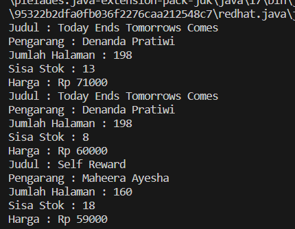
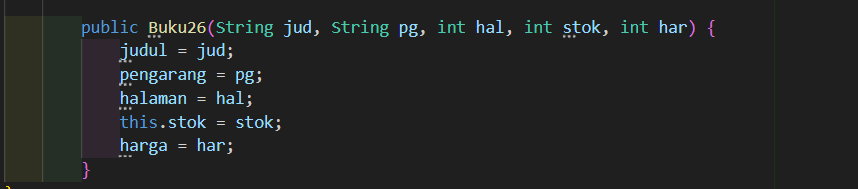
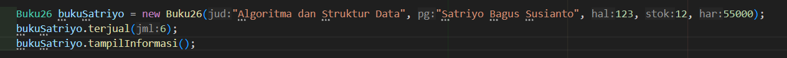
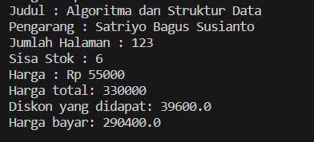
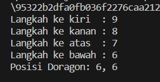
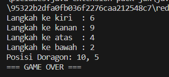

# **LAPORAN JOBSHEET 2**

---

---

## Nama    : Satriyo Bagus Susianto
## No      : 26
## Kelas   : 1-H
## NIM     : 2341720249

---

### A. Percobaan 1 : Deklarasi Class, Atribut, dan Method

#### Pertanyaan :
1. Sebutkan dua karakteristik class atau object!

> Atribut dan method

2. Perhatikan class Buku pada Praktikum 1 tersebut, ada berapa atribut yang dimiliki oleh class 
Buku? Sebutkan apa saja atributnya!

> Ada 5, yaitu :
> judul: String
> pengarang: String
> halaman: int
> stok: int
> harga: int

3. Ada berapa method yang dimiliki oleh class tersebut? Sebutkan apa saja methodnya!

> Ada 4, yaitu :
> tampilInformasi(): void
> terjual(jml: int): void
> restock(n: int): void
> gantiHarga(hrg: int): int

4. Perhatikan method terjual() yang terdapat di dalam class Buku. Modifikasi isi method tersebut 
sehingga proses pengurangan hanya dapat dilakukan jika stok masih ada (lebih besar dari 0)!

> 

5. Menurut Anda, mengapa method restock() mempunyai satu parameter berupa bilangan int?

> Karena method restok() digunakan untuk menambahkan jumlah stok dengan nilai yang spesifik

### B. Percobaan 2 : Instansiasi Object, serta Mengakses Atribut dan Method

#### Pertanyaan :
1. Pada class BukuMain, tunjukkan baris kode program yang digunakan untuk proses instansiasi!
Apa nama object yang dihasilkan?

> Nama objek yang dihasilkan adalah 'bk1'

2. Bagaimana cara mengakses atribut dan method dari suatu objek?

> Cara mengakses atribut adalah dengan mengetikkan (namaObjek).(namaAtribut)
Sedangkan untuk mengakses metode adalah dengan mengetikkan (namaObjek).(namaMethod())

3. Mengapa hasil output pemanggilan method tampilInformasi() pertama dan kedua berbeda?

> Karena terdapat beberapa pemanggilan methode yang berisikan perintah untuk mengubah nilai. 
Dalam kode program ini, terdapat pemanggilan method terjual() untuk mengurangi jumlah stok dan method gantiHarga() untuk mengganti harga.

### C. Percobaan 3 : Membuat Konstruktor

#### Pertanyaan :
1. Pada class Buku di Percobaan 3, tunjukkan baris kode program yang digunakan untuk 
mendeklarasikan konstruktor berparameter!

> 

2. Perhatikan class BukuMain. Apa sebenarnya yang dilakukan pada baris program berikut?

> Instansiasi dan mengakses atribut

3. Hapus konstruktor default pada class Buku, kemudian compile dan run program. Bagaimana 
hasilnya? Jelaskan mengapa hasilnya demikian!

> Hasilnya adalah 'undefined', karena tidak ada konstruktor khusus

4. Setelah melakukan instansiasi object, apakah method di dalam class Buku harus diakses 
secara berurutan? Jelaskan alasannya!

> Iya, karena dalam instansiasi memiliki urutan tipe data suatu nilai yang telah ditentukan.

5. Buat object baru dengan nama buku NamaMahasiswa menggunakan konstruktor 
berparameter dari class Buku!

> 

### Latihan Praktikum
1. Pada class Buku yang telah dibuat, tambahkan tiga method yaitu hitungHargaTotal(), 
hitungDiskon(), dan hitungHargaBayar() dengan penjelasan sebagai berikut:
    * Method hitungHargaTotal() digunakan untuk menghitung harga total yang merupakan perkalian antara harga dengan jumlah buku yang terjual

    * Method hitungDiskon() digunakan untuk menghitung diskon dengan aturan berikut:
        1. Jika harga total lebih dari 150000, maka harga didiskon sebesar 12%
        2. Jika harga total antara 75000 sampai 150000, maka harga didiskon sebesar 5%
        3. Jika harga total kurang dari 75000, maka harga tidak didiskon

    * Method hitungHargaBayar() digunakan untuk menghitung harga total setelah dikurangi diskon Class diagram Buku setelah penambahan ketiga method tersebut adalah sebagai berikut.

    

    > 

2. Buat program berdasarkan class diagram berikut ini!

    

    Penjelasan dari atribut dan method pada class Dragon tersebut adalah sebagai berikut:
    * Atribut x digunakan untuk menyimpan posisi koordinat x (mendatar) dari dragon, sedangkan atribut y untuk posisi koordinat y (vertikal)

    * Atribut width digunakan untuk menyimpan lebar dari area permainan, sedangkan height untuk menyimpan panjang area

    * Method moveLeft() digunakan untuk mengubah posisi dragon ke kiri (koordinat x akan berkurang 1), sedangkan moveRight() 
    untuk bergerak ke kanan (koordinat x akan bertambah 1). Perlu diperhatikan bahwa koordinat x tidak boleh lebih kecil dari 0 atau 
    lebih besar dari nilai width. Jika koordinat x < 0 atau x > width maka panggil method detectCollision()

    * Method moveUp() digunakan untuk mengubah posisi dragon ke atas (koordinat y akan 
berkurang 1), sedangkan moveDown() untuk bergerak ke bawah (koordinat y akan bertambah 1). Perlu diperhatikan bahwa koordinat y tidak boleh lebih kecil dari 0 atau lebih besar dari nilai height. Jika koordinat y < 0 atau y > height maka panggil method detectCollision()

    * Method detectCollision() akan mencetak pesan “Game Over” apabila dragon menyentuh ujung area permainan.

    > 

    > 

