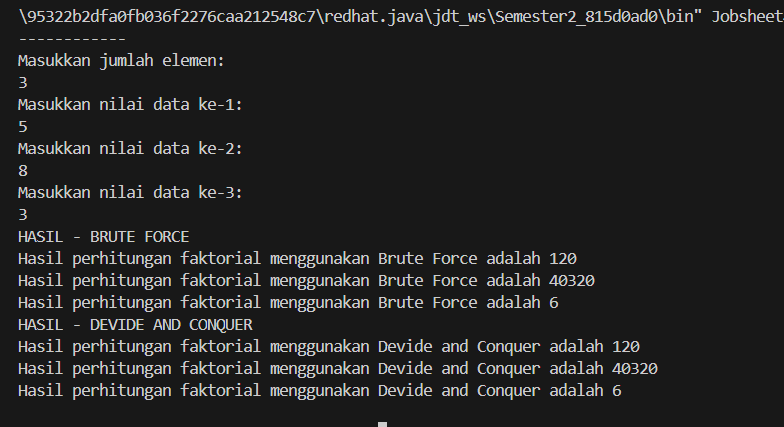

# **LAPORAN JOBSHEET 4**

---

---

## Nama    : Satriyo Bagus Susianto
## No      : 26
## Kelas   : 1-H
## NIM     : 2341720249

---

### A. Percobaan 1 : Menghitung Nilai Faktorial dengan Algoritma Brute Force dan Devide and Conquer

#### Pertanyaan :
1. Pada base line Algoritma Divide Conquer untuk melakukan pencarian nilai faktorial, jelaskan
perbedaan bagian kode pada penggunaan if dan else!

2. Apakah memungkinkan perulangan pada method faktorialBF() dirubah selain menggunakan
for?Buktikan!

3. Jelaskan perbedaan antara fakto *= i; dan int fakto = n * faktorialDC(n-1); !