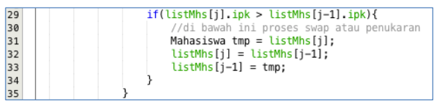
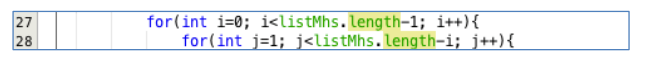
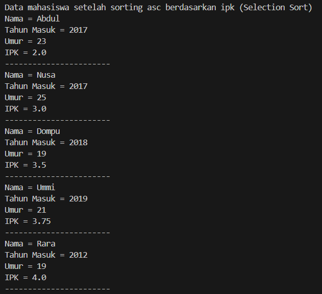
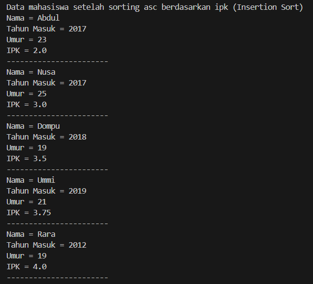

# **LAPORAN JOBSHEET 6**

---

---

## Nama    : Satriyo Bagus Susianto
## No      : 26
## Kelas   : 1-H
## NIM     : 2341720249

---

### A. Mengurutkan Data Mahasiswa Berdasarkan IPK Menggunakan Bubble Sort

#### Pertanyaan :
1. Terdapat di method apakah proses bubble sort?

2. Di dalam method bubbleSort(), terdapat baris program seperti di bawah ini:

Untuk apakah proses tersebut?

3. Perhatikan perulangan di dalam bubbleSort() di bawah ini:

a. Apakah perbedaan antara kegunaan perulangan i dan perulangan j?

b. Mengapa syarat dari perulangan i adalah i<listMhs.length-1 ?

c. Mengapa syarat dari perulangan j adalah j<listMhs.length-i ?

d. Jika banyak data di dalam listMhs adalah 50, maka berapakali perulangan i akan
berlangsung? Dan ada berapa Tahap bubble sort yang ditempuh?

### B.  Mengurutkan Data Mahasiswa Berdasarkan IPK Menggunakan Selection Sort

#### Pertanyaan :
1. Di dalam method selection sort, terdapat baris program seperti di bawah ini:

Untuk apakah proses tersebut, jelaskan!

### C. Mengurutkan Data Mahasiswa Berdasarkan IPK Menggunakan Insertion Sort

#### Pertanyaan :
1. Ubahlah fungsi pada InsertionSort sehingga fungsi ini dapat melaksanakan proses sorting
dengan cara descending.

### Latihan Praktikum
Sebuah platform travel yang menyediakan layanan pemesanan kebutuhan travelling sedang
mengembangkan backend untuk sistem pemesanan/reservasi akomodasi (penginapan), salah
satu fiturnya adalah menampilkan daftar penginapan yang tersedia berdasarkan pilihan filter
yang diinginkan user. Daftar penginapan ini harus dapat disorting berdasarkan

1. Harga dimulai dari harga termurah ke harga tertinggi.
2. Rating bintang penginapan dari bintang tertinggi (5) ke terendah (1)

Buatlah proses sorting data untuk kedua filter tersebut dengan menggunakan algoritma
bubble sort dan selection sort.

