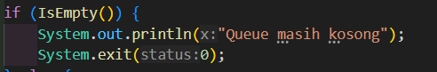

# **LAPORAN JOBSHEET 8**

---

---

## Nama    : Satriyo Bagus Susianto
## No      : 26
## Kelas   : 1-H
## NIM     : 2341720249

---

### A. Percobaan 1 :

#### Pertanyaan :
1. Pada konstruktor, mengapa nilai awal atribut front dan rear bernilai -1, sementara atribut size
bernilai 0?

> Atribut front dan rear diinisialisasi dengan nilai -1 untuk menunjukkan bahwa antrian pada awalnya kosong. Hal ini karena ketika front dan rear memiliki nilai -1, itu menandakan bahwa tidak ada elemen dalam antrian.

2.  Pada method Enqueue, jelaskan maksud dan kegunaan dari potongan kode berikut!

> Untuk menangani situasi di mana pointer rear telah mencapai batas maksimum array (max - 1) dalam representasi linear dari antrian. Dalam konteks ini, antrian diimplementasikan sebagai array linear dengan indeks 0 hingga max - 1.

3. Pada method Dequeue, jelaskan maksud dan kegunaan dari potongan kode berikut!

> Untuk menangani situasi di mana pointer front telah mencapai batas maksimum array (max - 1) dalam representasi linear dari antrian.

4. Pada method print, mengapa pada proses perulangan variabel i tidak dimulai dari 0 (int i=0),
melainkan int i=front?

> Karena perulangan dimulai dari nilai front karena front menunjukkan elemen pertama dalam antrian. Ini memastikan bahwa elemen-antrian dicetak sesuai urutan mereka dalam antrian, tidak bergantung pada lokasi elemen pertama dalam array.

5. Perhatikan kembali method print, jelaskan maksud dari potongan kode berikut!

> Untuk memperbarui nilai variabel i sehingga ia menunjuk ke indeks berikutnya dalam array yang digunakan untuk menyimpan elemen-antrian.

6. Tunjukkan potongan kode program yang merupakan queue overflow!

7. Pada saat terjadi queue overflow dan queue underflow, program tersebut tetap dapat berjalan
dan hanya menampilkan teks informasi. Lakukan modifikasi program sehingga pada saat terjadi
queue overflow dan queue underflow, program dihentikan!

### B. Percobaan 2:

#### Pertanyaan :
1. Pada class QueueMain, jelaskan fungsi IF pada potongan kode program berikut!

> Untuk memeriksa apakah semua atribut dalam objek 'data' memiliki nilai yang valid (tidak kosong atau bukan 0). Jika semua kondisi terpenuhi, maka 'data' dari objek data akan dicetak.

2. Lakukan modifikasi program dengan menambahkan method baru bernama peekRear pada class
Queue yang digunakan untuk mengecek antrian yang berada di posisi belakang! Tambahkan pula
daftar menu 5. Cek Antrian paling belakang pada class QueueMain sehingga method peekRear
dapat dipanggil!

### Tugas
Buatlah program antrian untuk mengilustasikan pesanan disebuah warung. Ketika seorang
pembeli akan mengantri, maka dia harus mendaftarkan nama, dan nomor HP seperti yangdigambarkan pada Class diagram berikut:

Class diagram Queue digambarkan sebagai berikut:

Keterangan :
- Method create(), isEmpty(), isFull(), enqueue(), dequeue() dan print(), kegunaannya sama seperti
yang telah dibuat pada Praktikum
- Method peek(): digunakan untuk menampilkan data Pembeli yang berada di posisi antrian paling
depan
- Method peekRear(): digunakan untuk menampilkan data Pembeli yang berada di posisi antrian
paling belakang
- Method peekPosition(): digunakan untuk menampilkan seorang pembeli (berdasarkan nama)
posisi antrian ke berapa
- Method daftarPembeli(): digunakan untuk menampilkan data seluruh pembeli

