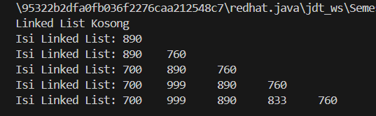
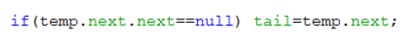
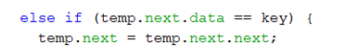
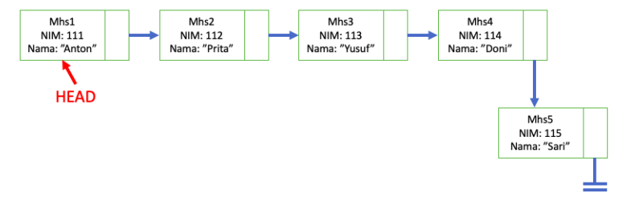

# **LAPORAN JOBSHEET 9**

---

---

## Nama    : Satriyo Bagus Susianto
## No      : 26
## Kelas   : 1-H
## NIM     : 2341720249

---

### A. Percobaan 1 : Pembuatan Single Linked List

#### Pertanyaan :
1. Mengapa hasil compile kode program di baris pertama menghasilkan “Linked List Kosong”?

2. Jelaskan kegunaan variable temp secara umum pada setiap method!
> isEmpty(): Tidak menggunakan variabel temp
> print(): Digunakan untuk menelusuri linked list dari awal hingga akhir. Variabel temp menunjuk ke node saat ini yang sedang diproses.
> addFirst(): Tidak menggunakan variabel temp
> addLast(): Tidak menggunakan variabel temp
> insertAfter(): Digunakan untuk menemukan node dengan nilai tertentu (key) dalam linked list, kemudian menambahkan node baru setelahnya. Variabel temp digunakan untuk traversing linked list hingga node dengan nilai yang dicari.
> insertAt(): Digunakan untuk menemukan posisi yang tepat di mana node baru akan dimasukkan. Variabel temp digunakan untuk traversing linked list hingga mencapai indeks yang sesuai sebelum menyisipkan node baru.

3. Perhatikan class SingleLinkedList, pada method insertAt Jelaskan kegunaan kode berikut

> Untuk memeriksa apakah node yang ditambahkan adalah node terakhir dalam linked list. Jika ya, maka tail (ekor) dari linked list diupdate untuk menunjuk ke node terakhir ini.

### B. Percobaan 2 : Modifikasi Elemen pada Single Linked List

#### Pertanyaan :
1. Mengapa digunakan keyword break pada fungsi remove? Jelaskan!
> Untuk menghentikan iterasi melalui linked list setelah operasi penghapusan dilakukan. Ini penting karena setelah kita menemukan dan menghapus elemen yang sesuai dengan kriteria pencarian (yaitu, elemen dengan nilai key), tidak perlu melanjutkan iterasi melalui sisa linked list.

2. Jelaskan kegunaan kode dibawah pada method remove

> Pada bagian kode 'else if(temp.next.data == key)', untuk memeriksa apakah nilai data dari node yang berikutnya adalah sama dengan nilai kunci yang ingin dihapus. Jika kondisi ini terpenuhi, itu berarti kita telah menemukan elemen yang ingin kita hapus dalam linked list.

### Tugas
1. Implementasikan ilustrasi Linked List Berikut. Gunakan 4 macam penambahan data yang telah
dipelajari sebelumnya untuk menginputkan data.

2. Buatlah implementasi program antrian layanan unit kemahasiswaan sesuai dengan kondisi yang
ditunjukkan pada soal nomor 1! Ketentuan :
- Implementasi antrian menggunakan Queue berbasis Linked List!
- Program merupakan proyek baru, bukan modifikasi dari soal nomor 1!
