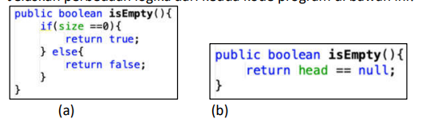

# **LAPORAN JOBSHEET 10**

---

---

## Nama    : Satriyo Bagus Susianto
## No      : 26
## Kelas   : 1-H
## NIM     : 2341720249

---

### A. Percobaan 1 :

#### Pertanyaan :
1. Jelaskan perbedaan antara single linked list dengan double linked lists!

> Single linked list memiliki setiap node yang terhubung ke node berikutnya dalam satu arah saja, sementara double linked list memiliki setiap node yang terhubung ke node sebelumnya dan berikutnya, memungkinkan traversal maju dan mundur.

2. Perhatikan class Node, di dalamnya terdapat atribut next dan prev. Untuk apakah atribut
tersebut?

> Atribut next digunakan untuk menunjukkan node berikutnya dalam double linked list, sementara atribut prev digunakan untuk menunjukkan node sebelumnya. Dengan memiliki kedua atribut ini, setiap node dapat mengakses node sebelumnya dan berikutnya dalam list.

3. Perhatikan konstruktor pada class DoubleLinkedLists. Apa kegunaan inisialisasi atribut head dan
size seperti pada gambar berikut ini?

> Inisialisasi atribut head dengan null menandakan bahwa awalnya linked list tidak memiliki node apa pun, karena tidak ada node yang menunjuk ke node lainnya. Inisialisasi size dengan nilai 0 menandakan bahwa linked list tersebut kosong pada awalnya, karena belum ada node yang dimasukkan ke dalamnya.

4. Pada method addFirst(), kenapa dalam pembuatan object dari konstruktor class Node prev dianggap sama dengan null?

    Node newNode = new Node(null, item, head);

> Dalam method addFirst(), ketika menambahkan node baru di posisi pertama dari double linked list, node baru tersebut menjadi node pertama baru. Oleh karena itu, node sebelumnya dari node baru (yang akan menjadi node kedua) adalah null, karena tidak ada node sebelumnya dalam double linked list ini. Jadi, pada pembuatan objek dari konstruktor class Node, parameter prev dianggap sama dengan null untuk menunjukkan bahwa node baru ini akan menjadi node pertama dalam linked list dan tidak memiliki node sebelumnya.

5. Perhatikan pada method addFirst(). Apakah arti statement head.prev = newNode ?

> Statement head.prev = newNode mengatur node yang sebelumnya menjadi kepala (head) untuk menunjuk ke node baru yang ditambahkan, sehingga menghubungkan node baru ke linked list secara ganda.

6. Perhatikan isi method addLast(), apa arti dari pembuatan object Node dengan mengisikan
parameter prev dengan current, dan next dengan null?

    Node newNode = new Node(current, item, null);

> Pembuatan objek Node dengan mengisikan parameter prev dengan current dan next dengan null berarti node baru terhubung ke node terakhir dan tidak memiliki node setelahnya.

7. Pada method add(), terdapat potongan kode program sebagai berikut:

Jelaskan maksud dari bagian yang ditandai dengan kotak kuning.

### B. Percobaan 2 :

#### Pertanyaan :
1. Apakah maksud statement berikut pada method removeFirst()?

    head = head.next;
    
    head.prev = null;

2. Bagaimana cara mendeteksi posisi data ada pada bagian akhir pada method removeLast()?

3. Jelaskan alasan potongan kode program di bawah ini tidak cocok untuk perintah remove!

4. Jelaskan fungsi kode program berikut ini pada fungsi remove!

### C. Percobaan 3 :

#### Pertanyaan :
1. Jelaskan method size() pada class DoubleLinkedLists!

2. Jelaskan cara mengatur indeks pada double linked lists supaya dapat dimulai dari indeks ke1!

3. Jelaskan perbedaan karakteristik fungsi Add pada Double Linked Lists dan Single Linked Lists!

4. Jelaskan perbedaan logika dari kedua kode program di bawah ini!

