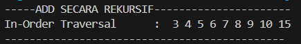
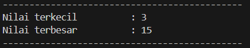
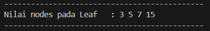
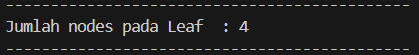
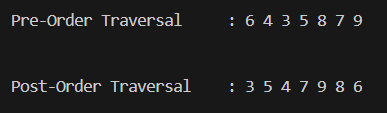

# **LAPORAN JOBSHEET 11**

---

---

## Nama    : Satriyo Bagus Susianto
## No      : 26
## Kelas   : 1-H
## NIM     : 2341720249

---

### A. Percobaan 1 : Implementasi Binary Search Tree menggunakan Linked List

#### Pertanyaan :
1. Mengapa dalam binary search tree proses pencarian data bisa lebih efektif dilakukan dibanding 
binary tree biasa?

> Binary search treem memiliki aturan yang jelas mengenai dimana data-data tersebut ditempatkan. Sehingga membuat pencarian lebih cepat dan efisien dibandingkan dengan binary tree biasa yang tidak memiliki aturan khusus. Binary tree biasa tidak lebih efisien karena kita program tersebut akan melakukan pencarian satu-persatu.

2. Untuk apakah di class Node, kegunaan dari atribut left dan right?

> Atribut left dan right adalah sebagai pointer atau penunjuk dimana letak data child/ anak. Atribut left menunjukkan ke child disebelah kiri, dan right menunjukkan ke child disebelah kanan.

3.  a. Untuk apakah kegunaan dari atribut root di dalam class BinaryTree?

> Atribut root adalah sebagai node utama/ induk dari sebuah tree
    
b. Ketika objek tree pertama kali dibuat, apakah nilai dari root?

> Ketika objek tree pertama kali dibuat, nilai dari root akan dinisiasi ke null terlbeih dahulu.

4. Ketika tree masih kosong, dan akan ditambahkan sebuah node baru, proses apa yang akan terjadi?

> Ketika tree masih kosong dan kemudian ditambahkan node baru, maka akan terjadi proses pengecekan terlbih dahulu, yaitu mengecek apakah tree kosong (menggunakan method isEmpty()), jika iya, maka node baru akan ditambahkan dan dijadikan sebagai root.

5. Perhatikan method add(), di dalamnya terdapat baris program seperti di bawah ini. Jelaskan 
secara detil untuk apa baris program tersebut?

> Pertama, akan dilakukan pengecekan apakah data yang ditmabahkan lebih kecil dari data di node saat ini. JIka iya, maka akan dilanjutkan proses pengecekan berikutnya, yakni apakah node anak kiri dari node saat ini tidak null/ kosong. Jika tidak null, maka pointer current/ pointer node-saat-ini akan dipindahkan ke node-anak-kiri dari node-saat-ini. Namun jika current.left (anak-kiri dari node-saat-ini) adalah kosong, maka data yang akan ditambahkan akan diletakkan di node current.left ini.

### Percobaan 2 : Implementasi binary tree dengan array

#### Pertanyaan :
1. Apakah kegunaan dari atribut data dan idxLast yang ada di class BinaryTreeArray?

> Atribut data adalah variabel yang digunakan untuk menyimpan data atua nilai, dan idxLast adalah indeks terkahir dari node yang ada pada data.

2. Apakah kegunaan dari method populateData()?

> Method populateData() digunakan untuk mengisi nilai pada data dan mengatur nilai indeks terakhir dari data yang disimpan.

3. Apakah kegunaan dari method traverseInOrder()?

> method traverseInOrder() digunakan untuk melakukan penelusuran pada binary tree yang nantinya akan diprint dalam bentuk urutan nilai dengan urutan left-root-right

4. Jika suatu node binary tree disimpan dalam array indeks 2, maka di indeks berapakah posisi 
left child dan rigth child masin-masing?

> Dengan root yang dimulai dari index 0,
maka anak kiri dari node 2 berada di indeks ke = 2i+1 = 2(2)+1 = 5
dan anak kanan dari node 2 berada di indeks ke = 2i+2 = 2(2)+2 = 6

5. Apa kegunaan statement int idxLast = 6 pada praktikum 2 percobaan nomor 4?

> statement int idxLast = 6 digunakan untuk menginisialisai variabel idxLast dengan nilai 6, yang menunjukkan bahwa akan ada 7 nilai yang diprint atau kurang dari sama dengan indeks ke-6.

### Tugas Praktikum
1. Buat method di dalam class BinaryTree yang akan menambahkan node dengan cara 
rekursif.

2. Buat method di dalam class BinaryTree untuk menampilkan nilai paling kecil dan yang 
paling besar yang ada di dalam tree.

3. Buat method di dalam class BinaryTree untuk menampilkan data yang ada di leaf.

4. Buat method di dalam class BinaryTree untuk menampilkan berapa jumlah leaf yang ada 
di dalam tree.

5. Modifikasi class BinaryTreeArray, dan tambahkan :

- method add(int data) untuk memasukan data ke dalam tree
- method traversePreOrder() dan traversePostOrder()

