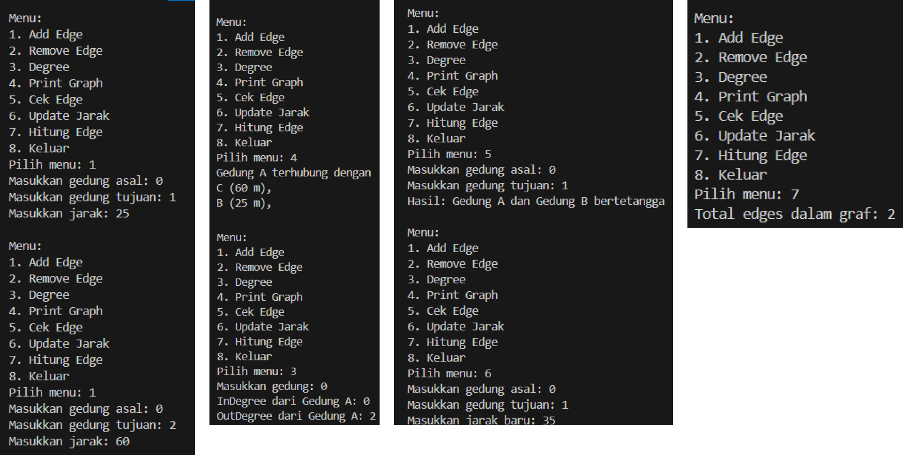

# **LAPORAN JOBSHEET 2**

---

---

## Nama    : Satriyo Bagus Susianto
## No      : 26
## Kelas   : 1-H
## NIM     : 2341720249

---

### A. Percobaan 1 : Implementasi Binary Search Tree menggunakan Linked List

#### Pertanyaan :
1. Mengapa dalam binary search tree proses pencarian data bisa lebih efektif dilakukan dibanding 
binary tree biasa?

2. Untuk apakah di class Node, kegunaan dari atribut left dan right?

3. a. Untuk apakah kegunaan dari atribut root di dalam class BinaryTree?

    b. Ketika objek tree pertama kali dibuat, apakah nilai dari root?

4. Ketika tree masih kosong, dan akan ditambahkan sebuah node baru, proses apa yang akan terjadi?

5. Perhatikan method add(), di dalamnya terdapat baris program seperti di bawah ini. Jelaskan 
secara detil untuk apa baris program tersebut?

### Percobaan 2 : Implementasi binary tree dengan array

#### Pertanyaan :
1. Apakah kegunaan dari atribut data dan idxLast yang ada di class BinaryTreeArray?

2. Apakah kegunaan dari method populateData()?

3. Apakah kegunaan dari method traverseInOrder()?

4. Jika suatu node binary tree disimpan dalam array indeks 2, maka di indeks berapakah posisi 
left child dan rigth child masin-masing?

5. Apa kegunaan statement int idxLast = 6 pada praktikum 2 percobaan nomor 4?

### Tugas Praktikum
1. Buat method di dalam class BinaryTree yang akan menambahkan node dengan cara 
rekursif.

2. Buat method di dalam class BinaryTree untuk menampilkan nilai paling kecil dan yang 
paling besar yang ada di dalam tree.

3. Buat method di dalam class BinaryTree untuk menampilkan data yang ada di leaf.

4. Buat method di dalam class BinaryTree untuk menampilkan berapa jumlah leaf yang ada 
di dalam tree.

5. Modifikasi class BinaryTreeArray, dan tambahkan :

- method add(int data) untuk memasukan data ke dalam tree
- method traversePreOrder() dan traversePostOrder()

