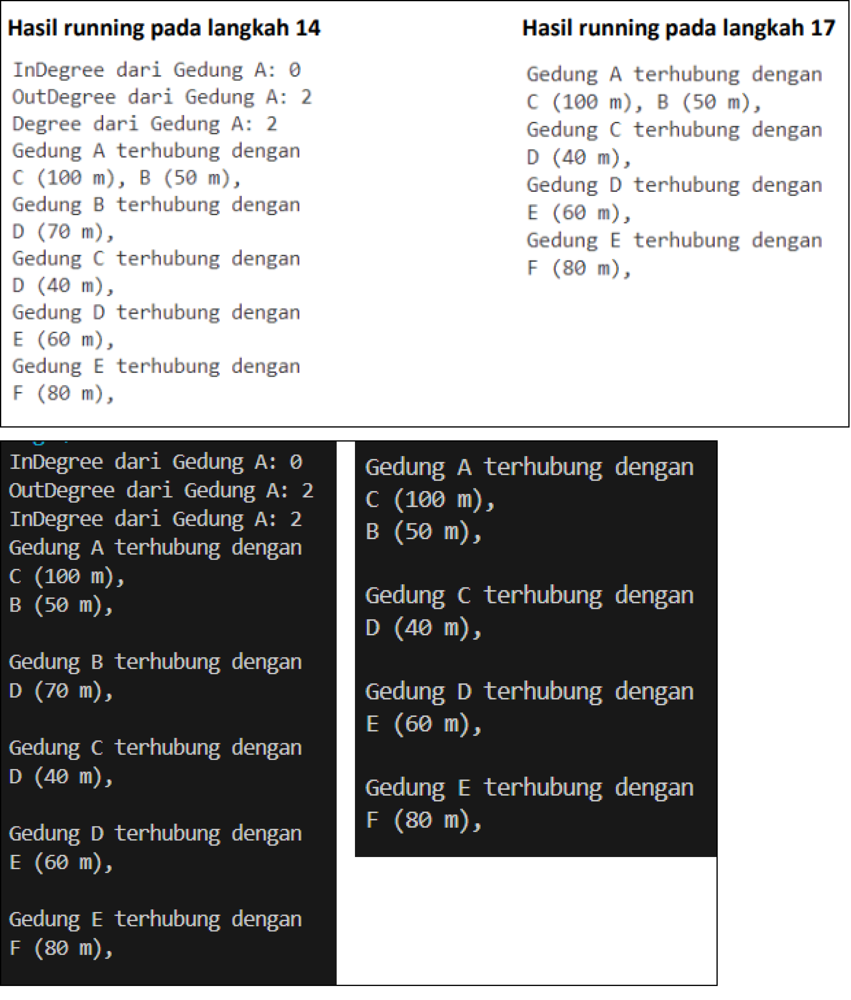
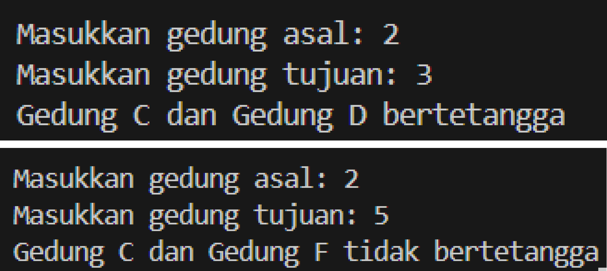
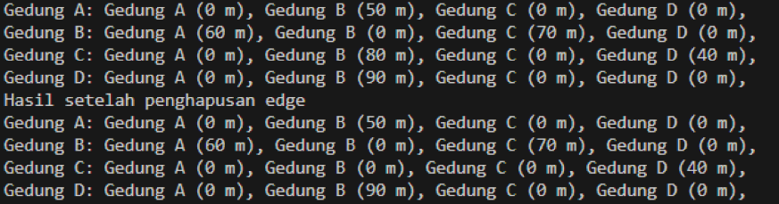
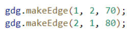
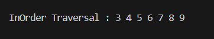

# **LAPORAN JOBSHEET 12**

---

---

## Nama    : Satriyo Bagus Susianto
## No      : 26
## Kelas   : 1-H
## NIM     : 2341720249

---

### A. Percobaan 1 : Implementasi Graph menggunakan Linked List

#### Pertanyaan :
1. Perbaiki kode program Anda apabila terdapat error atau hasil kompilasi kode tidak sesuai!

2. Pada class Graph, terdapat atribut list[] bertipe DoubleLinkedList. Sebutkan tujuan pembuatan variabel tersebut!

> Atribut list[] digunakan untuk merepresentasikan adjacency list dari graf. Setiap elemen dari array list[] adalah sebuah DoubleLinkedList23 yang menyimpan node-node tetangga dari vertex tersebut. Dalam graf berarah, jika ada edge dari vertex 𝑖 ke vertex 𝑗, maka vertex akan dimasukkan ke dalam DoubleLinkedList23 di list[i].

3. Jelaskan alur kerja dari method removeEdge!

> Method removeEdge pada class Graph23 bekerja dengan mencari edge yang menghubungkan vertex asal ke vertex tujuan dalam DoubleLinkedList23. Setelah menemukan edge yang menuju ke vertex tujuan, method ini akan menghapus edge tersebut dari DoubleLinkedList23. MAka edge yang menghubungkan vertex asal ke vertex tujuan akan dihapus, dan graf akan diperbarui.

4. Apakah alasan pemanggilan method addFirst() untuk menambahkan data, bukan method add jenis lain saat digunakan pada method addEdge pada class Graph?

> Metode addFirst() memiliki alur kerja yang lebih sederhana dan efisien, karena hanya melibatkan penambahan node baru di awal list tanpa perlu iterasi/ perulangan melalui seluruh elemen list, sehingga lebih cepat dibandingkan metode penambahan lainnya yang mungkin memerlukan traversal.

5. Modifikasi kode program sehingga dapat dilakukan pengecekan apakah terdapat jalur antara suatu node dengan node lainnya, seperti contoh berikut (Anda dapat memanfaatkan Scanner).

### Percobaan 2 : Implementasi Graph menggunakan Matriks

#### Pertanyaan :
1. Perbaiki kode program Anda apabila terdapat error atau hasil kompilasi kode tidak sesuai!

2. Apa jenis graph yang digunakan pada Percobaan 2?

> Graph Matriks, yang mana setiap baris dan kolom matriks mewakili vertex dalam graph, dan setiap elemen dalam matriks menunjukkan ada atau tidaknya edge antara dua vertex tersebut.

3. Apa maksud dari dua baris kode berikut?

> Dua baris kode tersebutr memiliki maksud untuk menambahkan edge dalam graph. Baris pertama gdg.makeEdge(1, 2, 70); menambahkan edge dari vertex 1 ke vertex 2 dengan bobot 70. Baris kedua gdg.makeEdge(2, 1, 80); menambahkan edge dari vertex 2 ke vertex 1 dengan bobot 80.

4. Modifikasi kode program sehingga terdapat method untuk menghitung degree, termasuk inDegree dan outDegree!

### Latihan Praktikum

