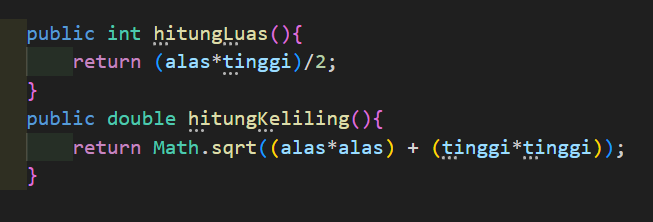

# **LAPORAN JOBSHEET 3**

---

---

## Nama    : Satriyo Bagus Susianto
## No      : 26
## Kelas   : 1-H
## NIM     : 2341720249

---

### A. Percobaan 1 : Membuat Array dari Object, Mengisi, dan Menampilkan

#### Pertanyaan :
1. Berdasarkan uji coba 3.2, apakah class yang akan dibuat array of object harus selalu memiliki atribut dan sekaligus method?Jelaskan!

> Tidak, sebuah class dapat memiliki atribut saja, method saja, atau keduanya bersamaan

2. Apakah class PersegiPanjang memiliki konstruktor?Jika tidak, kenapa dilakukan pemanggilan konstruktur pada baris program berikut :

    

> Tidak, karena java memberikan konstruktor default (tanpa parameter) secara otomatis

3. Apa yang dimaksud dengan kode berikut ini:

    

> Kode tersebut akan membuat sebuah array 'ppArray' yang dapat menampung 3 objek 'PersegiPanjang'

4. Apa yang dimaksud dengan kode berikut ini:

    

> 'ppArray[1] = new PersegiPanjang();' : Pada baris ini, kita membuat objek baru dari class 'PersegiPanjang' dan menyimpan referensinya di indeks ke-1 dari array 'ppArray'. Ini berarti kita membuat objek PersegiPanjang baru dan menempatkannya di posisi kedua dalam array

> 'ppArray[1].panjang = 80;' : Setelah objek PersegiPanjang dibuat, kita mengakses atribut panjang dari objek yang berada di indeks ke-1 dari array 'ppArray', kemudian memberikan nilai 80 ke atribut tersebut

> 'ppArray[1].lebar = 40;' : Setelah itu, kita mengakses atribut lebar dari objek yang berada di indeks ke-1 dari array 'ppArray', kemudian memberikan nilai 40 ke atribut tersebut

5. Mengapa class main dan juga class PersegiPanjang dipisahkan pada uji coba 3.2?

> Untuk meningkatkan keterbacaan, organisasi, dan pemeliharaan kode

### B. Percobaan 2 : Menerima Input Isian Array Menggunakan Looping

#### Pertanyaan :
1. Apakah array of object dapat diimplementasikan pada array 2 Dimensi?

> Iya 

2. Jika jawaban soal no satu iya, berikan contohnya! Jika tidak, jelaskan!
> Iya

3. Jika diketahui terdapat class Persegi yang memiliki atribut sisi bertipe integer, maka kode
dibawah ini akan memunculkan error saat dijalankan. Mengapa?

> karena konstruktor yang memiliki parameter untuk menginisialisasikan atribut sisi belum dipanggil

4. Modifikasi kode program pada praktikum 3.3 agar length array menjadi inputan dengan Scanner!

5. Apakah boleh Jika terjadi duplikasi instansiasi array of objek, misalkan saja instansiasi dilakukan
pada ppArray[i] sekaligus ppArray[0]?Jelaskan !
> Tidak boleh. Ketika sudah melakukan instansiasi objek pada ppArray[0], maka tidak diperlukan lagi untuk menginstansiasi objek pada ppArray[i] dengan nilai i=0. Jika hal tersebut dilakukan, maka nilai sebelumnya (nilai awal) akan tergantikan

### C. Percobaan 3 : Penambahan Operasi Matematika di Dalam Method

#### Pertanyaan :
1. Dapatkah konstruktor berjumlah lebih dalam satu kelas? Jelaskan dengan contoh!
> Bisa

2. Jika diketahui terdapat class Segitiga seperti berikut ini:

    

    Tambahkan konstruktor pada class Segitiga tersebut yang berisi parameter int a, int t yang masing-masing digunakan untuk mengisikan atribut alas dan tinggi.

3. Tambahkan method hitungLuas() dan hitungKeliling() pada class Segitiga
tersebut. Asumsi segitiga adalah segitiga siku-siku. (Hint: Anda dapat menggunakan bantuan
library Math pada Java untuk mengkalkulasi sisi miring)

4. Pada fungsi main, buat array Segitiga sgArray yang berisi 4 elemen, isikan masing-masing
atributnya sebagai berikut:

    

5. Kemudian menggunakan looping, cetak luas dan keliling dengan cara memanggil method
hitungLuas() dan hitungKeliling().

#### Latihan :
1. Buatlah program yang dapat menghitung luas permukaan dan volume bangun ruang kerucut,
limas segi empat sama sisi, dan bola. Buatlah 3 (tiga) class sesuai dengan jumlah jenis bangun
ruang. Buatlah satu main class untuk membuat array of objects yang menginputkan atributatribut yang ada menggunakan konstruktor semua bangun ruang tersebut. Dengan ketentuan:

    a. Buat looping untuk menginputkan masing-masing atributnya, kemudian tampilkan luas permukaan dan volume dari tiap jenis bangun ruang tersebut.

    b. Pada kerucut, inputan untuk atribut hanya jari-jari dan sisi miring
   
    c. Pada limas segi empat sama sisi, inputan untuk atribut hanya panjang sisi alas dan tinggi limas

    d. Pada bola, inpuntan untuk atribut hanya jari-jari

2. Sebuah kampus membutuhkan program untuk menampilkan informasi mahasiswa berupa nama,
nim, jenis kelamin dan juga IPK mahasiswa. Program dapat menerima input semua informasi
tersebut, kemudian menampilkanya kembali ke user. Implementasikan program tersebut jika
dimisalkan terdapat 3 data mahasiswa yang tersedia. Contoh output program:

    

3. Modifikasi program Latihan no.2 di atas, sehingga bisa digunakan untuk menghitung rata-rata IPK,
serta menampilkan data mahasiswa dengan IPK terbesar! (gunakan method untuk masing-masing
proses tersebut)

