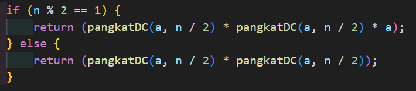

# **LAPORAN JOBSHEET 4**

---

---

## Nama    : Satriyo Bagus Susianto
## No      : 26
## Kelas   : 1-H
## NIM     : 2341720249

---

### A. Percobaan 1 : Menghitung Nilai Faktorial dengan Algoritma Brute Force dan Devide and Conquer

#### Pertanyaan :
1. Pada base line Algoritma Divide Conquer untuk melakukan pencarian nilai faktorial, jelaskan
perbedaan bagian kode pada penggunaan if dan else!
> IF : kode pada IF digunakan untuk menangani jika nilai yang di faktorialkan adalah 0 atau 1. Jika nilai yang difaktorialkan 0 atau 1 maka akan memberi nilai return 1
ELSE : kode pada ELSE merupakan pengulangan rekursif untuk menghitung n-faktorial. Dengan cara mengisi method faktorialDC() dengan (n-1) secara terus menerus sampai iterasi berakhir (saat hasil n-1 bernilai 1)

2. Apakah memungkinkan perulangan pada method faktorialBF() dirubah selain menggunakan
for?Buktikan!
> Bisa

3. Jelaskan perbedaan antara fakto *= i; dan int fakto = n * faktorialDC(n-1); !
> Pada fakto *= i;, kode menggunakan perkalian untuk menghitung nilai faktorial. Setiap iterasi, fakto mengalikan nilai fakto itu sendiri dengan nilai i increment dan berhenti sampai syarat terpenuhi. Pada int fakto = n * faktorialDC(n-1);, kode menggunakan rekursi untuk menghitung nilai faktorial. Setiap perulangan, nilai fakto berisi nilai n yang dikalikan dengan faktorialDC dari n-1.

### B. Percobaan 2 : Menghitung Hasil Pangkat dengan Algoritma Brute Force dan Divide and Conquer

#### Pertanyaan :
1. Jelaskan mengenai perbedaan 2 method yang dibuat yaitu PangkatBF() dan PangkatDC()!
> pangkatBF: pada metode ini pangkat dari suatu bilangan dihitung dengan mengalikan bilangan tersebut dengan dirinya sendiri sebanyak pangkat yang diinginkan. Misalnya, untuk menghitung bilangan a^n, makan a akan dikalikan dengan dirinya sendiri sebanyak n kali. pangkatDC : metode ini membagi perhitungan pangkat menjadi dua bagian Pertama, bagian untuk n/2 dan yang lainnya untuk n-n/2. Kemudian, hasilnya dikalikan kembali. Jika n adalah bilangan ganjil, maka satu bagian tambahan a juga akan dikalikan pada tahap teakhir.

2. Apakah tahap combine sudah termasuk dalam kode tersebut?Tunjukkan!
> Sudah

3. Modifikasi kode program tersebut, anggap proses pengisian atribut dilakukan dengan
konstruktor.

4. Tambahkan menu agar salah satu method yang terpilih saja yang akan dijalankan menggunakan
switch-case!

### C. Percobaan 3 : Menghitung Sum Array dengan Algoritma Brute Force dan Divide and Conquer

#### Pertanyaan :
1. Mengapa terdapat formulasi return value berikut?Jelaskan!

> return lsum + rsum + arr[mid]; digunakan untuk mengembalikan total nilai dengan menjumlah nilai di bagian kiri (lsum), bagian kanan (rsum), dan elemen tengah (mid) dari array tersebut.

2. Kenapa dibutuhkan variable mid pada method TotalDC()?
> mid dibutuhkan untuk menandai posisi tengah array kemudain membagi array menjadi dua bagian yang lebih kecil, yaitu bagian kiri dan bagian kanan pada setiap pengulangan rekursif. Setela itu, setiap bagian dari array dihitung secara terpisah dan digabungkan lagi di akhir proses.

3. Program perhitungan keuntungan suatu perusahaan ini hanya untuk satu perusahaan saja.
Bagaimana cara menghitung sekaligus keuntungan beberapa bulan untuk beberapa
perusahaan.(Setiap perusahaan bisa saja memiliki jumlah bulan berbeda-beda)? Buktikan
dengan program!

### Latihan Praktikum
1. Sebuah showroom memiliki daftar mobil dengan data sesuai tabel di bawah ini :

Tentukan :

    a. top_acceleration tertinggi menggunakan Divide and Conquer!

    b. top_acceleration terendah menggunakan Divide and Conquer!

    c. Rata-rata top_power dari seluruh mobil menggunakan Brute Force!

