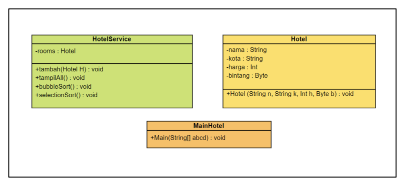

# **LAPORAN JOBSHEET 5**

---

---

## Nama    : Satriyo Bagus Susianto
## No      : 26
## Kelas   : 1-H
## NIM     : 2341720249

---

### A. Mengurutkan Data Mahasiswa Berdasarkan IPK Menggunakan Bubble Sort

#### Pertanyaan :
1. Terdapat di method apakah proses bubble sort?
> Di method bubbleSort()

2. Di dalam method bubbleSort(), terdapat baris program seperti di bawah ini:

Untuk apakah proses tersebut?
> Proses yang dilakukan pada baris tersebut adalah mengecek apakah nilai IPK di indeks j lebih besar dari nilai IPK di indeks j-1. Jika kondisi benar, maka akan di-swap antara nilai mahasiswa di indeks j dan j-1.

3. Perhatikan perulangan di dalam bubbleSort() di bawah ini:

a. Apakah perbedaan antara kegunaan perulangan i dan perulangan j?
> Perulangan i digunakan untuk mengatur batas perulangan. Seriap perulangan i, nilai terbesar akan di-swap ke bagian paling kanan dari array. Perulangan j` digunakan untuk membandingkan kemudian menukar nilai yang berdekatan.

b. Mengapa syarat dari perulangan i adalah i<listMhs.length-1 ?
> Karena pada perulanagn terakhir, nilai terbesar sudah di-swap ke posisi yang benar yaitu di ujung kanan array, sehingga pertukaran hanya perlu dilakukan sejumal j-1.

c. Mengapa syarat dari perulangan j adalah j<listMhs.length-i ?
> Karena di setiap perulangan i, nilai terbesar paling kanan yang sudah urut, jadi tidak perlu lagi dibandingkan dan di-swap.

d. Jika banyak data di dalam listMhs adalah 50, maka berapakali perulangan i akan
berlangsung? Dan ada berapa Tahap bubble sort yang ditempuh?
> Jika terdapat 50 data dalam listMhs, perulangan i akan berlangsung sebanyak 50 kali, dan terdapat 50 tahap Bubble Sort yang ditempuh untuk mengurutkan seluruh elemen secara descending berdasarkan nilai ipk.

### B.  Mengurutkan Data Mahasiswa Berdasarkan IPK Menggunakan Selection Sort

#### Pertanyaan :
1. Di dalam method selection sort, terdapat baris program seperti di bawah ini:

Untuk apakah proses tersebut, jelaskan!
> Kode tersebut bertujuan untuk menemukan indeks dari elemen terkecil (dalam hal ini, Mahasiswa20 dengan ipk terkecil) dalam bagian array yang belum diurutkan.

### C. Mengurutkan Data Mahasiswa Berdasarkan IPK Menggunakan Insertion Sort

#### Pertanyaan :
1. Ubahlah fungsi pada InsertionSort sehingga fungsi ini dapat melaksanakan proses sorting
dengan cara descending.

### Latihan Praktikum
Sebuah platform travel yang menyediakan layanan pemesanan kebutuhan travelling sedang
mengembangkan backend untuk sistem pemesanan/reservasi akomodasi (penginapan), salah
satu fiturnya adalah menampilkan daftar penginapan yang tersedia berdasarkan pilihan filter
yang diinginkan user. Daftar penginapan ini harus dapat disorting berdasarkan

1. Harga dimulai dari harga termurah ke harga tertinggi.
2. Rating bintang penginapan dari bintang tertinggi (5) ke terendah (1)

Buatlah proses sorting data untuk kedua filter tersebut dengan menggunakan algoritma
bubble sort dan selection sort.

