# **LAPORAN JOBSHEET 7**

---

---

## Nama    : Satriyo Bagus Susianto
## No      : 26
## Kelas   : 1-H
## NIM     : 2341720249

---

### A. Percobaan 1 : Penyimpanan Tumpukan Barang dalam Gudang

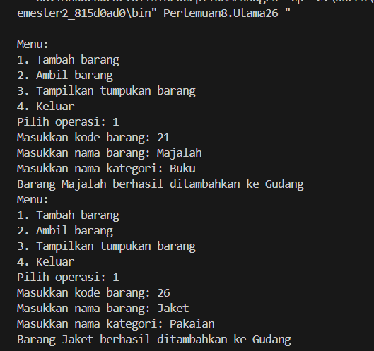
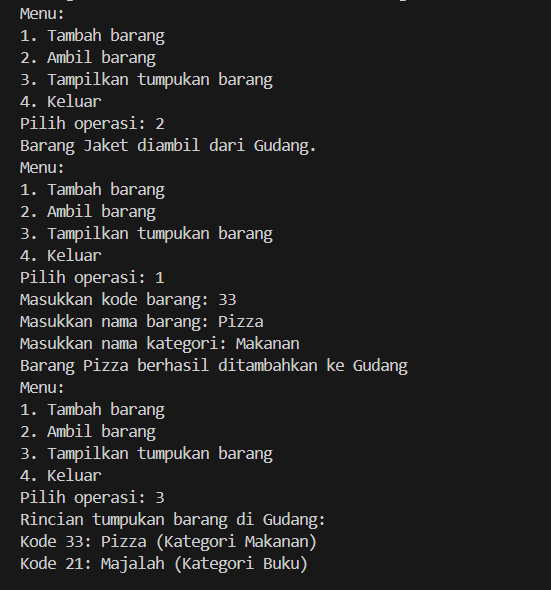

#### Pertanyaan :
1. Lakukan perbaikan pada kode program, sehingga keluaran yang dihasilkan sama dengan verifikasi
hasil percobaan! Bagian mana saja yang perlu diperbaiki?
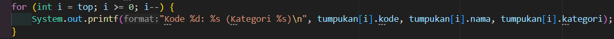

2. Berapa banyak data barang yang dapat ditampung di dalam tumpukan? Tunjukkan potongan kode
programnya!
> Ada 7 data yang bisa ditampung

3. Mengapa perlu pengecekan kondisi !cekKosong() pada method tampilkanBarang? Kalau kondisi
tersebut dihapus, apa dampaknya?
> Pengecekan kondisi gudang diperlukan untuk memastikan apakah ada barang atau tidak di dalamnya, jika tidak ada pengecekan, method tersebut tidak akan menampilkan informasi apa pun jika gudang kosong. Sebaliknya, jika melakukan pengecekan terlebih dahulu, kita dapat menentukan output yang sesuai, jika gudang tidak berisi barang, dengan kata lain, pengecekan kondisi gudang membantu method untuk memberikan informasi yang lebih akurat dan lengkap.

4. Modifikasi kode program pada class Utama sehingga pengguna juga dapat memilih operasi lihat
barang teratas, serta dapat secara bebas menentukan kapasitas gudang!
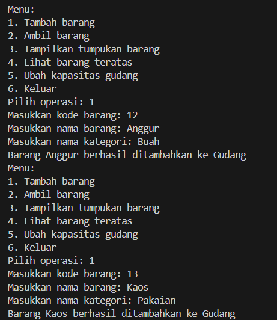
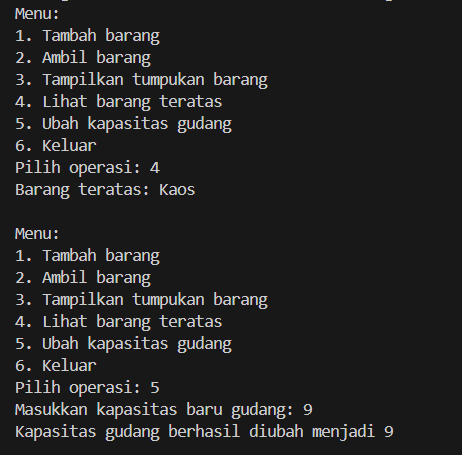

5. Commit dan push kode program ke Github

### B. Percobaan 2 : Konversi Kode Barang ke Biner

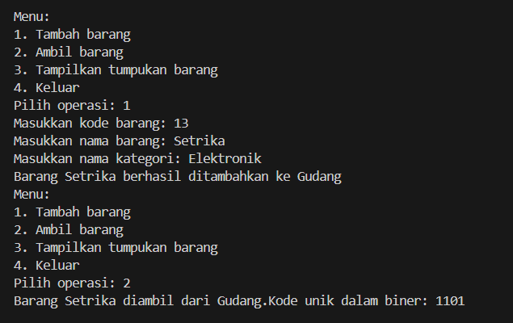

#### Pertanyaan :
1. Pada method konversiDesimalKeBiner, ubah kondisi perulangan menjadi while (kode != 0),
bagaimana hasilnya? Jelaskan alasannya!
> Hasilnya tetap sama dan program masih dapat dijalankan. Hal ini terjadi karena nilai kode (kode dari barang yang dihapus) seharusnya bernilai min (-). Jika menggunakan kondisi kode > 0, maka output dari kode unik akan bernilai null (kosong). Namun, jika menggunakan kode != 0, maka output dari kode uniknya bernilai min (-).

2. Jelaskan alur kerja dari method konversiDesimalKeBiner!
> Ketika dimasukkan sebuah nilai, method ini akan membagi nilai tersebut dengan 2 dan menyimpan sisa bagi (modulus) pada setiap perulangan. Karena sifat stack LIFO (Last In, First Out), maka dari itu sisa-sisa ini kemudian disusun secara terbalik dalam sebuah stack. Setelah semua sisa telah dimasukkan, method akan mengembalikan string biner.

### C. Percobaan 3 : Konversi Notasi Infix ke Postfix

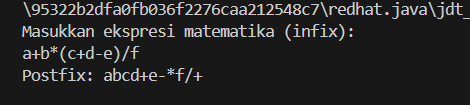

#### Pertanyaan :
1. Pada method derajat, mengapa return value beberapa case bernilai sama? Apabila return
value diubah dengan nilai berbeda-beda setiap case-nya, apa yang terjadi?
> Beberapa case memiliki return value yang sama karena beberapa case operatornya memeiliki prioritas yang sama. Jika return valuenya diubah dengan nilai berbeda-beda maka kedudukan dari setiap operator akan berbeda-beda yang dimana akan menimbulkan error dalam konversi postfixnya.

2. Jelaskan alur kerja method konversi!
> Metode konversi akan melakukan perulangan untuk setiap karakter dalam ekspresi infix untuk diverifikasi. Jika karakter tersebut adalah operand, maka langsung dimasukkan ke dalam ekspresi postfix yang dihasilkan. Jika itu adalah tanda kurung buka, maka dimasukkan ke dalam stack. Ketika menemui tanda kurung tutup, operator-operator dalam stack dipindahkan ke ekspresi postfix hingga menemukan tanda kurung buka yang sesuai. Untuk operator, dilakukan pengecekan prioritasnya dengan operator yang ada di stack. Operator-operator dengan prioritas lebih tinggi atau sama akan dipindahkan ke ekspresi postfix, sementara operator saat ini akan dipush ke dalam stack. Setelah iterasi selesai, semua operator yang tersisa di stack dipindahkan ke ekspresi postfix. Hasilnya, ekspresi postfix yang dihasilkan dikembalikan.

3. Pada method konversi, apa fungsi dari potongan kode berikut?
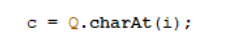
> Dalam metode tersebut, 'Q.charAt(i)' mengambil karakter pada posisi 'i' dari string 'Q' dan menyimpannya dalam variabel 'c'.

### Latihan Praktikum
1. Perhatikan dan gunakan kembali kode program pada Percobaan 1. Tambahkan dua method berikut
pada class Gudang:
- Method lihatBarangTerbawah digunakan untuk mengecek barang pada tumpukan terbawah
- Method cariBarang digunakan untuk mencari ada atau tidaknya barang berdasarkan kode
barangnya atau nama barangnya

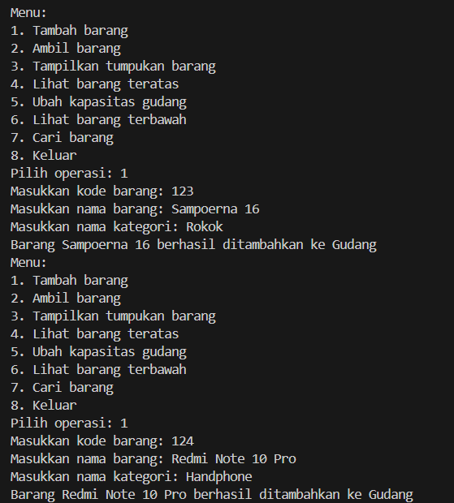
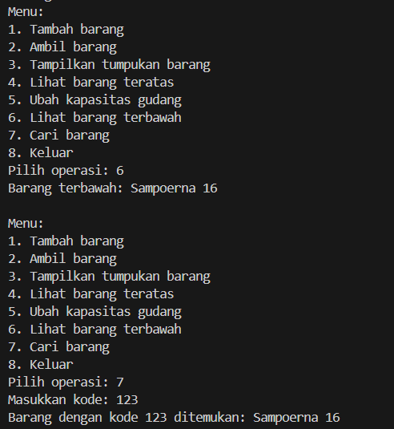
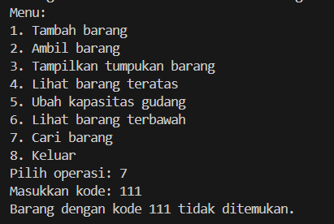